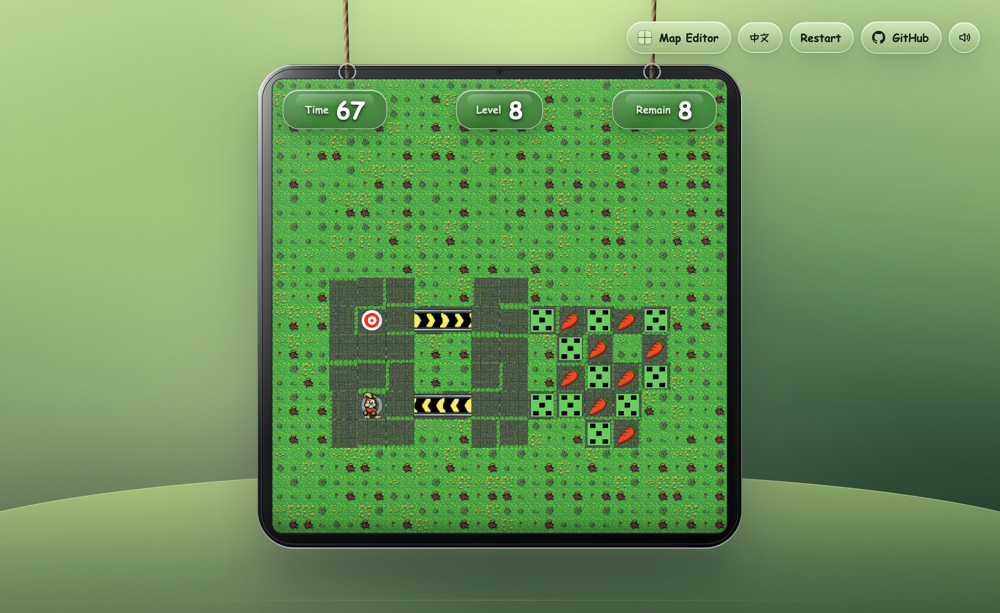

# Bobby Carrot

Language: [中文](README.md) | English  
Architecture docs: [中文](docs/architecture.md) | [English](docs/architecture.en.md)

Bobby Carrot is a grid-based puzzle game built with Vite and TypeScript. The player guides Bobby through 50px tile maps, collects the required carrots, understands each mechanism, and reaches the exit.



Play online: [https://g.snapre.fun/](https://g.snapre.fun/)

The terminal edition is available on npm:

```sh
npm install -g bobbygame
bobby-carrot
```

## Game Goal

Each level is a small mechanism puzzle:

- Collect the required number of carrots for the current level.
- Avoid or use traps, directional stones, conveyors, locks, and buttons.
- Find a valid route and reach the exit once it opens.
- Use arrow keys or WASD on desktop, or the on-screen direction pad on mobile.
- The web game and `/editor` both support Chinese and English.

## Level Design

The project currently includes 30 built-in levels. Level data is split into one file per level under `src/content/levels/`. Each level is made from a tilemap, entity instances, and mechanism variables, then converted into runtime game state.

Core design elements:

- **Carrot target**: each level has its own required carrot count. The HUD shows the remaining count.
- **Keys and locks**: keys match locks by color. Opening a lock consumes the key state for that color in the level flow.
- **Directional stones**: Bobby can only enter and leave through allowed directions. After Bobby leaves, the stone rotates clockwise.
- **Stones**: stones limit movement by their current direction. Red buttons affect stone direction across the map.
- **Conveyors**: conveyors move Bobby in one direction and block reverse entry. Yellow buttons reverse conveyor direction.
- **Button groups**: stepping on one button toggles other buttons of the same type and triggers the linked mechanism change.
- **Traps**: traps can become armed after Bobby leaves them. Stepping on a dangerous trap causes failure.
- **Exit**: the exit opens after the carrot requirement is satisfied. Entering the open exit completes the level.

The levels are designed around observation before action. Many routes depend on changing mechanism state, planning trigger order, and using one-way movement rather than simply walking continuously.

## Community Level Editor

`/editor` provides a browser-based community level editor for local level creation:

- Start from a blank level or load built-in `map1` through `map30` as references.
- Place terrain, carrots, mechanisms, exits, and the player on a 50px grid with tile and entity tools that preview the real assets.
- Use entity tools for the main objects in the sprite atlases: fences, trap states, directional stones, conveyor directions, button states, three key/lock colors, and decoration assets.
- Inspect and adjust asset animation definitions in the Asset Animation panel, including actions, frame sequences, speed, looping, single-frame atlas coordinates, and manifest JSON export.
- Edit directional stone, conveyor, key/lock, button, and trap state in the property panel.
- Reuse runtime level validation in real time for missing players, missing exits, invalid carrot targets, out-of-bounds entities, and similar issues.
- Playtest the current draft directly inside the editor page.
- Export `.bobby-level.json` files containing title, author, difficulty, tags, and the `LevelDefinition`.
- Save drafts to the browser's local community level library, then open them in game mode.
- Use Undo / Redo, and drag entities in the select tool.

The first editor release is a local file workflow with no account system or server dependency. Community submissions can be shared as `.bobby-level.json` files, issues, or pull requests. Before accepting a level into the built-in set, run:

```sh
npm run validate:levels
```

After saving a community level locally, it can also be opened by URL:

```txt
http://localhost:5173/?community=<local-level-id>
```

## Local Development

```sh
npm install
npm run dev
```

Default dev server:

```txt
http://localhost:5173/
```

Open a specific level with a query parameter:

```txt
http://localhost:5173/?map=map20
```

Open the community level editor:

```txt
http://localhost:5173/editor
```

Build and verify:

```sh
npm run typecheck
npm run validate:levels
npm run build
```

## Terminal Edition

The project also ships a TUI edition that runs the same level data directly in the terminal:

```sh
npm install -g bobbygame
bobby-carrot
```

The package provides two command names. `bobby-carrot` is the full command and `bobbyc` is the short alias:

```sh
bobby-carrot --map map1
bobbyc --map map20 --ascii
```

You can also run the npm package temporarily without installing it globally:

```sh
npx --package bobbygame bobbyc --map map1
```

For local development, build the TUI first and then run it:

```sh
npm run build:tui
node dist-tui/cli.js --map map1
```

The TUI uses emoji and symbols by default for terrain, blockers, the player, targets, keys, locks, buttons, and conveyors. If your terminal handles emoji width inconsistently, switch to ASCII mode:

```sh
bobby-carrot --map map1 --ascii
```

Terminal controls:

- Arrow keys / WASD: move Bobby
- R: restart the current level
- N: go to the next level after winning
- Q / Ctrl+C: quit

Build a local npm package:

```sh
npm pack
npm install -g ./bobbygame-*.tgz
bobby-carrot
```

## Technical Architecture

The full architecture document is published at [`docs/architecture.en.md`](docs/architecture.en.md). The Chinese version is available at [`docs/architecture.md`](docs/architecture.md). It covers runtime boundaries, data flow, simulation layers, content loading, editor architecture, TUI architecture, build/deploy behavior, and extension points.

High-level structure:

```txt
src/main.ts                  Browser entry point
src/game/runtime.ts          Browser runtime lifecycle, input, simulation, render loop
src/game/simulation.ts       Pure game-state update entry point
src/game/levelDefinition.ts  Level definition data structures
src/game/stateFactory.ts     LevelDefinition to GameState conversion
src/game/levelValidation.ts  Level structure and data-quality validation
src/game/movement.ts         Grid movement, collision, locks, conveyors
src/game/interactions.ts     Carrots, keys, traps, exits, and arrival interactions
src/game/buttons.ts          Red/yellow button mechanism updates
src/game/render.ts           Canvas rendering, HUD, win/fail overlays
src/game/touchControls.ts    Mobile direction pad
src/tools/validate-levels.ts Level validation CLI
src/tui/cli.ts               Terminal edition entry and character rendering
src/content/levels/          Level data, one file per level
src/content/assets.ts        Sprite atlas coordinates and animation config
public/assets/               Image, audio, and font assets
docs/architecture.en.md      English technical architecture document
```

## Contributing

Contributions are most useful around level design and mechanism behavior. Good contribution areas include:

- **Add levels**: create a new `mapXX.ts` based on the current level format, and explain the carrot target, mechanism combination, and intended solution idea.
- **Improve levels**: fix unreachable paths, incorrect mechanism direction, misleading layout, or routes that are too hard or too easy.
- **Fix mechanisms**: if a rule behaves differently from the expected design, provide a minimal reproduction level or patch the runtime logic directly.
- **Improve assets**: refine sprites, audio, HUD behavior, or mobile controls while keeping the original pixel-game style.
- **Test and verify**: add solution notes, screenshots, or regression checks for important levels.

Suggested pull request flow:

1. Keep each PR focused on one topic, such as "fix map4 conveyor direction" or "add map31".
2. For level changes, describe the playable route before and after the change.
3. For mechanism changes, describe which entity types are affected and include a test level or screenshot when practical.
4. Before submitting, run `npm run typecheck`, `npm run validate:levels`, and `npm run build`.

## Technical Notes

This is a pure Vite and TypeScript project. Maps, sprites, mechanisms, and the state machine are all driven by repository code and data, which keeps the game easy to maintain and extend without a backend service.

## Star History

<a href="https://www.star-history.com/?repos=bobbygame%2Fbobbygame.github.io&type=date&legend=top-left">
 <picture>
   <source media="(prefers-color-scheme: dark)" srcset="https://api.star-history.com/chart?repos=bobbygame/bobbygame.github.io&type=date&theme=dark&legend=top-left" />
   <source media="(prefers-color-scheme: light)" srcset="https://api.star-history.com/chart?repos=bobbygame/bobbygame.github.io&type=date&legend=top-left" />
   
 </picture>
</a>
