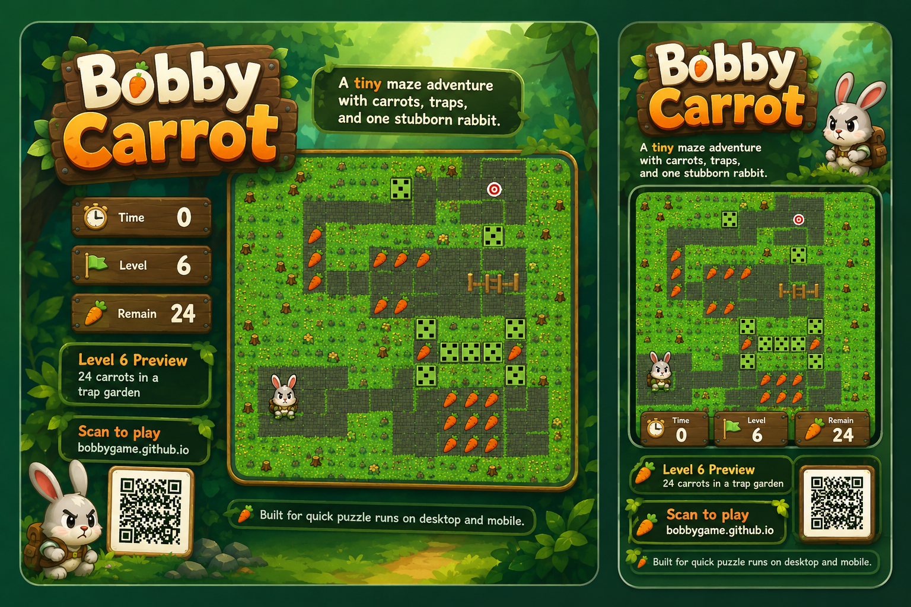
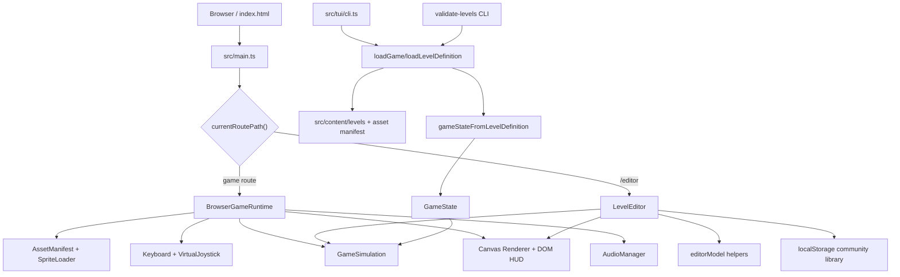
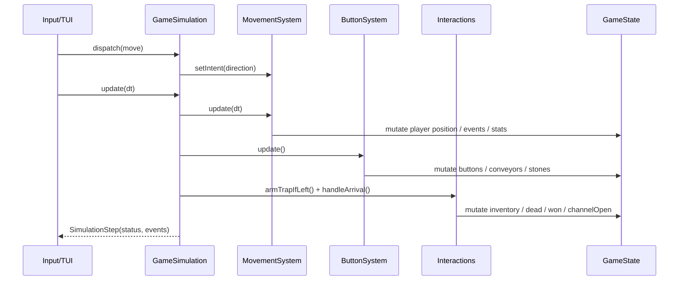
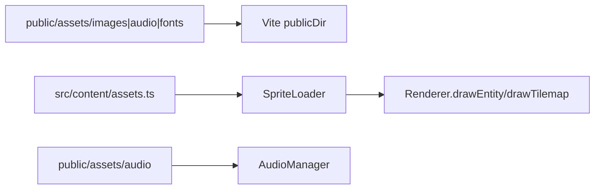

# Bobby Carrot

Language: English | [Chinese](README.zh.md)

Bobby Carrot is a grid-based puzzle game built with Vite and TypeScript. The player guides Bobby through 50px tile maps, collects the required carrots, learns each mechanism, and reaches the exit.



Play online: [https://g.snapre.fun/](https://g.snapre.fun/)

The terminal edition is available on npm:

```sh
npm install -g bobbygame
bobby-carrot
```

## Game Goal

Each level is a small mechanism puzzle:

- Collect the required number of carrots for the current level.
- Avoid or use traps, directional stones, conveyors, locks, and buttons.
- Find a valid route and reach the exit once it opens.
- Use arrow keys or WASD on desktop, or the on-screen direction pad on mobile.
- The web game and `/editor` both support Chinese and English.

## Level Design

The project currently includes 30 built-in levels. Level data is split into one file per level under `src/content/levels/`. Each level is made from a tilemap, entity instances, and mechanism variables, then converted into runtime game state.

Core design elements:

- **Carrot target**: each level has its own required carrot count. The HUD shows the remaining count.
- **Keys and locks**: keys match locks by color. Opening a lock consumes the key state for that color in the level flow.
- **Directional stones**: Bobby can only enter and leave through allowed directions. After Bobby leaves, the stone rotates clockwise.
- **Stones**: stones limit movement by their current direction. Red buttons affect stone direction across the map.
- **Conveyors**: conveyors move Bobby in one direction and block reverse entry. Yellow buttons reverse conveyor direction.
- **Button groups**: stepping on one button toggles other buttons of the same type and triggers the linked mechanism change.
- **Traps**: traps can become armed after Bobby leaves them. Stepping on a dangerous trap causes failure.
- **Exit**: the exit opens after the carrot requirement is satisfied. Entering the open exit completes the level.

The levels are designed around observation before action. Many routes depend on changing mechanism state, planning trigger order, and using one-way movement rather than simply walking continuously.

## Community Level Editor

`/editor` provides a browser-based community level editor for local level creation:

- Start from a blank level or load built-in `map1` through `map30` as references.
- Place terrain, carrots, mechanisms, exits, and the player on a 50px grid with tile and entity tools that preview the real assets.
- Use entity tools for the main objects in the sprite atlases: fences, trap states, directional stones, conveyor directions, button states, three key/lock colors, and decoration assets.
- Inspect and adjust asset animation definitions in the Asset Animation panel, including actions, frame sequences, speed, looping, single-frame atlas coordinates, and manifest JSON export.
- Edit directional stone, conveyor, key/lock, button, and trap state in the property panel.
- Reuse runtime level validation in real time for missing players, missing exits, invalid carrot targets, out-of-bounds entities, and similar issues.
- Playtest the current draft directly inside the editor page.
- Export `.bobby-level.json` files containing title, author, difficulty, tags, and the `LevelDefinition`.
- Save drafts to the browser's local community level library, then open them in game mode.
- Use Undo / Redo, and drag entities in the select tool.

The first editor release is a local file workflow with no account system or server dependency. Community submissions can be shared as `.bobby-level.json` files, issues, or pull requests. Before accepting a level into the built-in set, run:

```sh
npm run validate:levels
```

After saving a community level locally, it can also be opened by URL:

```txt
http://localhost:5173/?community=<local-level-id>
```

## Local Development

```sh
npm install
npm run dev
```

Default dev server:

```txt
http://localhost:5173/
```

Open a specific level with a query parameter:

```txt
http://localhost:5173/?map=map20
```

Open the community level editor:

```txt
http://localhost:5173/editor
```

Build and verify:

```sh
npm run typecheck
npm run validate:levels
npm run build
```

## Terminal Edition

The project also ships a TUI edition that runs the same level data directly in the terminal:

```sh
npm install -g bobbygame
bobby-carrot
```

The package provides two command names. `bobby-carrot` is the full command and `bobbyc` is the short alias:

```sh
bobby-carrot --map map1
bobbyc --map map20 --ascii
```

You can also run the npm package temporarily without installing it globally:

```sh
npx --package bobbygame bobbyc --map map1
```

For local development, build the TUI first and then run it:

```sh
npm run build:tui
node dist-tui/cli.js --map map1
```

The TUI uses emoji and symbols by default for terrain, blockers, the player, targets, keys, locks, buttons, and conveyors. If your terminal handles emoji width inconsistently, switch to ASCII mode:

```sh
bobby-carrot --map map1 --ascii
```

Terminal controls:

- Arrow keys / WASD: move Bobby
- R: restart the current level
- N: go to the next level after winning
- Q / Ctrl+C: quit

Build a local npm package:

```sh
npm pack
npm install -g ./bobbygame-*.tgz
bobby-carrot
```

## Technical Architecture

This section consolidates the project architecture into the main README. It describes the current codebase boundaries, module responsibilities, data flow, build behavior, and extension points.

### 1. Product Scope

Bobby Carrot is a pure Vite + TypeScript grid puzzle game. Built-in levels are maintained as `LevelDefinition` TypeScript modules, and the game rules are centralized in a state machine and simulator.

The repository currently provides four capabilities:

- Browser game: `src/main.ts` starts the app, and `src/game/runtime.ts` manages asset loading, input, simulation, and Canvas rendering.
- Community level editor: `/editor` lazily loads `src/editor/app.ts` and supports local editing, import/export, localStorage saves, and in-browser playtesting.
- Terminal edition: `src/tui/cli.ts` builds to `dist-tui/cli.js` and renders the same levels through the same `GameSimulation`.
- Data validation tool: `src/tools/validate-levels.ts` validates all built-in levels in batch.

### 2. Stack And Runtime Shape

| Area | Current implementation |
| --- | --- |
| Language | TypeScript, ES modules |
| Build tool | Vite |
| Web runtime | Static site, Canvas 2D rendering, DOM HUD/overlays |
| TUI runtime | Node 20 target, ANSI/emoji/ASCII rendering |
| Content source | `src/content/levels/map*.ts` and `src/content/assets.ts` |
| Persistence | Built-in levels are packaged with the app; community levels are stored in browser localStorage |
| Deployment | GitHub Pages; `.github/workflows/static.yml` builds and deploys `dist` from the `main` branch |

The project has no backend service, database, account system, or network API. Apart from loading static assets, the core game runs locally on the client.

### 3. Top-Level Architecture



The architectural center is `GameSimulation` plus `GameState`. The browser game, editor playtest, TUI, and validation CLI all work around the same level definitions and state conversion path. Their differences are mainly input, rendering, audio, and host-environment concerns.

### 4. Directory Responsibilities

| Path | Responsibility |
| --- | --- |
| `src/main.ts` | Web entry point; routes to the game runtime or editor |
| `src/game/` | Game domain core, browser runtime, rendering, input, assets, audio, state generation, and level validation |
| `src/content/` | Built-in levels and asset manifest; `index.ts` provides dynamic level loading |
| `src/content/levels/` | 30 built-in levels, one `mapXX.ts` file per level |
| `src/editor/` | Community level editor UI and pure editor model helpers |
| `src/tui/` | Terminal edition entry point and character rendering |
| `src/tools/` | Node tool entry points, currently the level validation CLI |
| `public/assets/` | Static image, audio, and font assets |
| `dist/`, `dist-tui/`, `dist-tools/` | Build outputs |

### 5. Core Data Model

#### 5.1 LevelDefinition

`src/game/levelDefinition.ts` defines the runtime level format:

- `LevelDefinition`: level name, pixel dimensions, required carrot count, tilemap, and entity list.
- `LevelTilemapDefinition`: grid columns, rows, tile size, tile data, and tilemap type name.
- `LevelEntityDefinition`: entity ID, semantic type, asset type name, pixel position, grid position, size, instance variables, and angle.

Built-in levels export `LevelDefinition` directly. Community levels use the same structure inside a wrapper that stores metadata such as title, author, difficulty, and tags.

#### 5.2 GameState

`src/game/types.ts` defines `GameState`, the simulator's single mutable state container. It includes:

- Current map name, tile size, and tilemap data.
- All entities and the player entity reference.
- Carrot and key inventory state.
- Win/loss status, exit-open status, and recently touched mechanism IDs.
- Time, step count, and animation state.
- Event records used for audio feedback and debugging.

This design keeps rule updates in one state object. Browser rendering and TUI rendering read state instead of implementing their own game rules.

### 6. Browser Runtime Flow

`BrowserGameRuntime` coordinates the browser game:

1. `src/main.ts` reads `?map=` and `?community=` query parameters.
2. `BrowserGameRuntime.start()` loads the asset manifest, preloads images, and binds keyboard plus virtual joystick input.
3. Built-in levels use `loadLevelDefinition(mapName)`; community levels use `getCommunityLevel(id)`.
4. `validateLevelDefinition()` emits diagnostics during load.
5. `gameStateFromLevelDefinition()` creates `GameState`, then `GameSimulation` is created from that state.
6. `Renderer` owns the Canvas, HUD, and success overlay, and redraws from `GameState` every frame.
7. The `requestAnimationFrame` loop handles input, simulation updates, event-driven audio, and rendering.
8. After a win, `advance` opens the next built-in level. Community levels do not automatically advance into the built-in sequence.

Core entry files:

- `src/main.ts`
- `src/game/runtime.ts`
- `src/game/loader.ts`
- `src/game/stateFactory.ts`
- `src/game/render.ts`
- `src/game/input.ts`
- `src/game/touchControls.ts`

### 7. Simulation And Rule Layers

`src/game/simulation.ts` is the pure game-rule entry point. It does not depend on DOM, Canvas, audio, or browser APIs. It only depends on `GameState` and `GameAction`.

The simulator is split into three rule layers:

| Module | Responsibility |
| --- | --- |
| `movement.ts` | Single-tile movement, walkable tile checks, bounds checks, collision, locks, directional stones, conveyor entry rules, and chained conveyor movement |
| `buttons.ts` | Conveyor-button and stone-button state changes, plus linked mechanism flips/rotations |
| `interactions.ts` | Arrival handling: carrot/key pickup, lock opening, traps, stone rotation after leaving a tile, exit checks, and level completion |

Single-step update flow:



Movement uses a discrete grid intent plus pixel interpolation. A single key press consumes one direction intent, then Bobby moves toward the target tile at a fixed speed. This fits grid puzzles and lets the TUI advance the same simulator with fixed ticks.

Walkable terrain is defined by dark stone tile IDs `7-11` in the tilemap. Grass and decorative ground tile IDs `0-6` are visual background and are not walkable. Fence entities, locks, directional stones, conveyors, and other mechanism rules are layered after the base walkability check.

### 8. Content And Asset Pipeline

Built-in content has two parts:

- Level definitions: `src/content/levels/map1.ts` through `map30.ts`, dynamically loaded by `src/content/index.ts`.
- Asset manifest: `src/content/assets.ts`, which describes object names, default frames, animation frames, sprite atlas coordinates, and animation speed.

Asset load path:



Level files store tilemap data, entities, and required carrot counts directly. After modifying content, run `npm run validate:levels` to check structural consistency.

### 9. Editor Architecture

`/editor` is a route-lazy local editor built from two main parts:

- `src/editor/app.ts`: editor UI, event binding, Canvas drawing, asset previews, import/export, localStorage library, and playtest overlay.
- `src/editor/editorModel.ts`: pure editor helpers for blank levels, entity tools, tile palettes, entity creation, movement, resizing, and community level file parsing.

The editor reuses the main game stack:

- `loadLevelDefinition()` loads built-in levels as references.
- `validateLevelDefinition()` provides live structural diagnostics.
- Playtest uses `gameStateFromLevelDefinition()`, `GameSimulation`, and `Renderer` inside the current page.
- `createCommunityLevel()`, `saveCommunityLevel()`, and `listCommunityLevels()` manage the browser-local level library.

Community level persistence is defined in `src/game/communityLevel.ts`. The current `schemaVersion` is `1`. Community levels are stored under localStorage key `bobby.communityLevels.v1` and are not synchronized to a server.

### 10. TUI Architecture

`src/tui/cli.ts` provides the terminal edition:

- Loads the same `GameState` through `loadGame(mapName)`.
- Uses `GameSimulation` for movement, mechanisms, and win/loss rules.
- Renders the viewport with ANSI screen control, colors, emoji tokens, or ASCII tokens.
- Supports `--map` for level selection and `--ascii` for ASCII rendering.

The TUI and browser game share the core rules but do not share Canvas rendering, audio, touch input, or browser asset-loading code. This creates a clear port/adapter boundary in the current architecture.

### 11. Build, Validation, And Deployment

| Command | Purpose |
| --- | --- |
| `npm run dev` | Start the Vite dev server, defaulting to `http://localhost:5173/` |
| `npm run build` | Build the browser static site into `dist` |
| `npm run build:tui` | Build the terminal CLI into `dist-tui/cli.js` |
| `npm run build:tools` | Build tool entry points into `dist-tools` |
| `npm run typecheck` | Run TypeScript type checking |
| `npm run validate:levels` | Build the validation tool and validate all built-in levels |
| `npm run preview` | Preview the built `dist` output locally |

Deployment is configured in `.github/workflows/static.yml`. GitHub Actions uses Node 22, `npm ci`, `npm run typecheck`, and `npm run build`, then publishes `dist` to GitHub Pages.

The Vite web build uses root path `base: /`. During GitHub Pages builds, `dist/index.html` is copied to `dist/404.html` and `dist/editor/index.html` so static hosting can handle the app routes.

### 12. Key Architecture Decisions

| Decision | Current benefit | Cost or caution |
| --- | --- | --- |
| Pure client-side static app | Simple deployment; GitHub Pages can host it; game logic is easy to reproduce locally | No server features; community levels are local files/localStorage unless submitted by file or PR |
| Rules centered in `GameSimulation` | Browser, TUI, and editor playtest share one rule implementation | `GameState` is mutable, so new mechanisms must be careful about field semantics and side-effect order |
| Level data as TypeScript modules | Vite can statically analyze/dynamically import them, and types stay close to data | Adding a level requires updating indexes and level progression config |
| Rendering separated from rules | Canvas, TUI, and editor surfaces can adapt output independently | UI layers still read entity fields directly, so entity shape changes affect multiple surfaces |
| Local-first editor | No account or backend required; low-friction level creation | localStorage has capacity and sync limits; exported files remain the durable sharing format |

### 13. Extension Guide

#### Add A Level

1. Add `src/content/levels/map31.ts`.
2. Update `src/content/index.ts` with `levelNames` and `levelLoaders` entries.
3. Set the level's `requiredCarrots` value.
4. Update `src/game/levelProgression.ts` by changing `LAST_LEVEL_NUMBER`.
5. Run `npm run typecheck` and `npm run validate:levels`.

#### Add An Entity Or Mechanism

1. Extend `EntityKind` in `src/game/types.ts`.
2. Add validation rules in `src/game/levelValidation.ts`.
3. Update `movement.ts`, `buttons.ts`, or `interactions.ts` depending on the rule behavior.
4. Add sprite selection behavior in `src/game/sprites.ts`.
5. Add editor tooling in `src/editor/editorModel.ts` and verify the property panel in `src/editor/app.ts`.
6. Add terminal token rendering and priority in `src/tui/cli.ts`.

#### Add Server-Backed Community Features

The most natural path is to keep the `CommunityLevel` schema and replace or extend the localStorage adapter with remote storage. A server-backed community system should start with:

- Level upload, list, download, and delete APIs.
- `schemaVersion` validation and migration.
- Author identity or submission moderation.
- Server-side level validation that reuses or ports `validateLevelDefinition()`.

### 14. Risks And Watch Points

| Risk | Impact | Mitigation |
| --- | --- | --- |
| Mutable `GameState` updates are spread across several rule modules | New mechanisms can introduce order-dependent bugs | Add minimal regression levels or simulator unit tests for complex mechanisms |
| Built-in level data and asset manifest are large | Manual edits can miss fields or break structure | Run level validation after changes and prefer editor-exported level data when practical |
| Editor, browser, and TUI all read entity fields | Field renames can affect multiple surfaces | Define new fields through central types and validation before spreading them to adapters |
| localStorage community levels do not sync | Users can lose local libraries after clearing storage or switching devices | Emphasize export files now; add remote community storage later |
| Canvas rendering has no automated visual regression | UI or asset changes may only be caught by manual playtesting | Add screenshot smoke tests for key levels and editor flows |

### 15. Quick Reference

```txt
src/main.ts                  Browser entry point
src/game/runtime.ts          Browser runtime lifecycle, input, simulation, render loop
src/game/simulation.ts       Pure game-state update entry point
src/game/levelDefinition.ts  Level definition data structures
src/game/stateFactory.ts     LevelDefinition to GameState conversion
src/game/levelValidation.ts  Level structure and data-quality validation
src/game/movement.ts         Grid movement, collision, locks, conveyors
src/game/interactions.ts     Carrots, keys, traps, exits, and arrival interactions
src/game/buttons.ts          Red/yellow button mechanism updates
src/game/render.ts           Canvas rendering, HUD, win/fail overlays
src/game/touchControls.ts    Mobile direction pad
src/tools/validate-levels.ts Level validation CLI
src/tui/cli.ts               Terminal edition entry and character rendering
src/content/levels/          Level data, one file per level
src/content/assets.ts        Sprite atlas coordinates and animation config
public/assets/               Image, audio, and font assets
```

## Contributing

Contributions are most useful around level design and mechanism behavior. Good contribution areas include:

- **Add levels**: create a new `mapXX.ts` based on the current level format, and explain the carrot target, mechanism combination, and intended solution idea.
- **Improve levels**: fix unreachable paths, incorrect mechanism direction, misleading layout, or routes that are too hard or too easy.
- **Fix mechanisms**: if a rule behaves differently from the expected design, provide a minimal reproduction level or patch the runtime logic directly.
- **Improve assets**: refine sprites, audio, HUD behavior, or mobile controls while keeping the original pixel-game style.
- **Test and verify**: add solution notes, screenshots, or regression checks for important levels.

Suggested pull request flow:

1. Keep each PR focused on one topic, such as "fix map4 conveyor direction" or "add map31".
2. For level changes, describe the playable route before and after the change.
3. For mechanism changes, describe which entity types are affected and include a test level or screenshot when practical.
4. Before submitting, run `npm run typecheck`, `npm run validate:levels`, and `npm run build`.

## Technical Notes

This is a pure Vite and TypeScript project. Maps, sprites, mechanisms, and the state machine are all driven by repository code and data, which keeps the game easy to maintain and extend without a backend service.

## Star History

<a href="https://www.star-history.com/?repos=bobbygame%2Fbobbygame.github.io&type=date&legend=top-left">
 <picture>
   <source media="(prefers-color-scheme: dark)" srcset="https://api.star-history.com/chart?repos=bobbygame/bobbygame.github.io&type=date&theme=dark&legend=top-left" />
   <source media="(prefers-color-scheme: light)" srcset="https://api.star-history.com/chart?repos=bobbygame/bobbygame.github.io&type=date&legend=top-left" />
   
 </picture>
</a>
