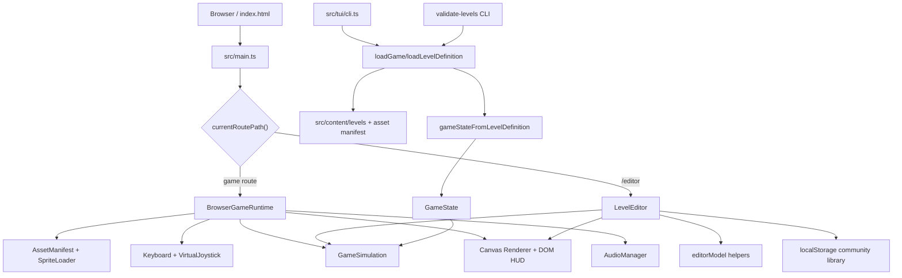
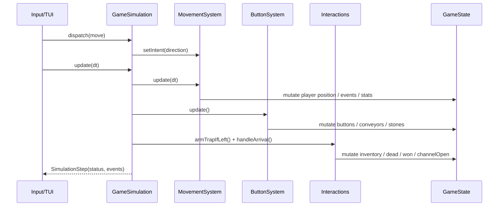
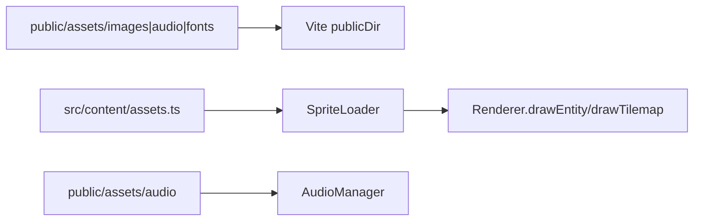

# Bobby Carrot

语言：[English](README.md) | 中文

Bobby Carrot 是一个纯 Vite + TypeScript 实现的网格解谜游戏。玩家控制兔子在 50px 网格地图中移动，收集每关要求的胡萝卜，理解机关规则，最终抵达出口。


在线试玩：[https://g.snapre.fun/](https://g.snapre.fun/)

终端版已发布到 npm：

```sh
npm install -g bobbygame
bobby-carrot
```

## 游戏目标

每一关都是一个小型机关谜题：

- 收集当前关卡要求数量的胡萝卜。
- 避开或利用陷阱、方向石、传送带、锁和按钮。
- 找到可行路径，到达终点或打开出口。
- 在移动端可以使用底部方向舵，桌面端使用方向键或 WASD。
- 网页游戏和 `/editor` 都支持中文 / English 切换。

## 关卡设计

项目目前包含 30 个关卡，关卡数据按文件拆分在 `src/content/levels/`。每关由 tilemap、实体实例和机关变量组成，运行时统一转换为游戏状态。

核心设计元素：

- **胡萝卜目标**：每关有独立的收集目标，HUD 中的 `Remain` 会显示剩余数量。
- **钥匙与锁**：钥匙按颜色匹配锁，开锁后钥匙会被消耗，已持有钥匙会显示在右上角。
- **方向石**：只能从开口方向进出。兔子踩过后离开格子时，方向石顺时针旋转一次。
- **石块**：按当前方向限制通行。红色按钮会影响地图内石块方向。
- **传送带**：按单向方向传送兔子，不能逆向进入。黄色按钮会反转传送带方向。
- **按钮组**：踩下当前按钮后，同类型其他按钮会反转状态，并触发对应机关变化。
- **陷阱**：第一次踩下会进入待触发状态，离开后重新变危险；再次踩中会失败。
- **出口**：满足胡萝卜数量后出口打开，进入后完成关卡。

关卡设计鼓励“先观察，再行动”：很多路线不是靠连续移动完成，而是通过改变机关状态、规划踩踏顺序和利用单向移动完成。

## 社区关卡编辑器

`/editor` 提供一个网页关卡编辑器，面向社区共建关卡的本地创作流程：

- 从空白关卡开始，或加载内置 `map1` 到 `map30` 作为参考。
- 使用真实素材预览的 tile 和 entity 工具在 50px 网格上摆放地形、胡萝卜、机关、出口和玩家。
- 实体工具覆盖素材图集里的主要关卡对象：栅栏/墙体、陷阱状态、方向石、传送带方向、按钮状态、三色钥匙锁和装饰素材。
- 右侧 Asset Animation 面板可以查看和调整素材对象的动画定义，包括动作、帧序列、速度、循环状态和单帧 atlas 坐标，并可导出修改后的 asset manifest JSON。
- 通过右侧属性面板编辑方向石、传送带、钥匙锁、按钮和陷阱状态。
- 实时复用运行时关卡校验，提示缺玩家、缺出口、目标胡萝卜数量不合理、实体出界等问题。
- 使用 Playtest 在当前浏览器页内直接试玩正在编辑的关卡。
- 导出 `.bobby-level.json`，里面包含标题、作者、难度、标签和 `LevelDefinition`。
- 使用 Save Local 保存到浏览器本地关卡库，再用 Open Game 直接以游戏模式打开。
- 支持 Undo / Redo，选择工具下可以拖拽移动实体。

第一版编辑器是本地文件流，不依赖账号或服务器。社区投稿可以先以 `.bobby-level.json` 附件、issue 或 PR 的方式提交；正式收录前应运行：

```sh
npm run validate:levels
```

保存到本地关卡库后，也可以用 URL 直接试玩：

```txt
http://localhost:5173/?community=<local-level-id>
```

## 本地开发

```sh
npm install
npm run dev
```

默认地址：`http://localhost:5173/`

指定关卡可以加查询参数：

```txt
http://localhost:5173/?map=map20
```

社区关卡编辑器：

```txt
http://localhost:5173/editor
```

构建：

```sh
npm run typecheck
npm run validate:levels
npm run build
```

## 终端版本

项目同时提供一个 TUI 版本，可以在终端里直接玩同一套关卡数据：

```sh
npm install -g bobbygame
bobby-carrot
```

安装后会提供两个命令入口，`bobby-carrot` 是完整命令，`bobbyc` 是短命令：

```sh
bobby-carrot --map map1
bobbyc --map map20 --ascii
```

也可以不全局安装，直接临时运行 npm 包：

```sh
npx --package bobbygame bobbyc --map map1
```

本地开发时可以先构建再运行：

```sh
npm run build:tui
node dist-tui/cli.js --map map1
```

TUI 默认使用 emoji / symbol 渲染，地砖、障碍、玩家、目标、钥匙、锁、按钮和传送带都会用终端字符展示。部分终端对 emoji 宽度处理不一致时，可以切换到 ASCII 模式：

```sh
bobby-carrot --map map1 --ascii
```

终端控制：

- 方向键 / WASD：移动兔子
- R：重开当前关
- N：通关后进入下一关
- Q / Ctrl+C：退出

本地生成 npm 安装包：

```sh
npm pack
npm install -g ./bobbygame-*.tgz
bobby-carrot
```

## 技术架构

本节把当前项目架构集中整理到中文 README 中，覆盖代码边界、模块职责、数据流、构建方式和扩展入口。

### 1. 产品范围

Bobby Carrot 是一个纯 Vite + TypeScript 网格解谜游戏。内置关卡以 `LevelDefinition` TypeScript 模块维护，游戏规则集中在状态机和模拟器中。

仓库目前提供四类能力：

- 浏览器游戏：`src/main.ts` 启动应用，`src/game/runtime.ts` 管理资源加载、输入、模拟和 Canvas 渲染。
- 社区关卡编辑器：`/editor` 懒加载 `src/editor/app.ts`，支持本地编辑、导入导出、localStorage 保存和浏览器内试玩。
- 终端版本：`src/tui/cli.ts` 构建到 `dist-tui/cli.js`，通过同一个 `GameSimulation` 渲染同一套关卡。
- 数据校验工具：`src/tools/validate-levels.ts` 批量校验所有内置关卡。

### 2. 技术栈和运行形态

| 领域 | 当前实现 |
| --- | --- |
| 语言 | TypeScript、ES modules |
| 构建工具 | Vite |
| Web 运行时 | 静态站点、Canvas 2D 渲染、DOM HUD/覆盖层 |
| TUI 运行时 | Node 20 target、ANSI/emoji/ASCII 渲染 |
| 内容来源 | `src/content/levels/map*.ts` 和 `src/content/assets.ts` |
| 持久化 | 内置关卡随应用打包；社区关卡保存在浏览器 localStorage |
| 部署 | GitHub Pages；`.github/workflows/static.yml` 从 `main` 分支构建并部署 `dist` |

项目没有后端服务、数据库、账号系统或网络 API。除了加载静态素材，核心游戏逻辑都在客户端本地运行。

### 3. 顶层架构



架构中心是 `GameSimulation` 和 `GameState`。浏览器游戏、编辑器试玩、TUI 和校验 CLI 都围绕同一套关卡定义和状态转换路径工作，差异主要在输入、渲染、音频和宿主环境适配。

### 4. 目录职责

| 路径 | 职责 |
| --- | --- |
| `src/main.ts` | Web 入口；按路由进入游戏运行时或编辑器 |
| `src/game/` | 游戏领域核心、浏览器运行时、渲染、输入、素材、音频、状态生成和关卡校验 |
| `src/content/` | 内置关卡和素材 manifest；`index.ts` 提供动态关卡加载 |
| `src/content/levels/` | 30 个内置关卡，每关一个 `mapXX.ts` 文件 |
| `src/editor/` | 社区关卡编辑器 UI 和纯编辑器模型辅助函数 |
| `src/tui/` | 终端版本入口和字符渲染 |
| `src/tools/` | Node 工具入口，目前是关卡校验 CLI |
| `public/assets/` | 静态图片、音频和字体素材 |
| `dist/`、`dist-tui/`、`dist-tools/` | 构建产物 |

### 5. 核心数据模型

#### 5.1 LevelDefinition

`src/game/levelDefinition.ts` 定义运行时关卡格式：

- `LevelDefinition`：关卡名、像素尺寸、所需胡萝卜数量、tilemap 和实体列表。
- `LevelTilemapDefinition`：网格列数、行数、tile 尺寸、tile 数据和 tilemap 类型名。
- `LevelEntityDefinition`：实体 ID、语义类型、素材类型名、像素位置、网格位置、尺寸、实例变量和角度。

内置关卡直接导出 `LevelDefinition`。社区关卡使用同样结构，并包在一个包含标题、作者、难度和标签等元数据的外层对象中。

#### 5.2 GameState

`src/game/types.ts` 定义 `GameState`，它是模拟器唯一的可变状态容器，包含：

- 当前地图名、tile 尺寸和 tilemap 数据。
- 所有实体和玩家实体引用。
- 胡萝卜与钥匙库存状态。
- 胜负状态、出口开启状态，以及最近触发过的机关 ID。
- 时间、步数和动画状态。
- 用于音频反馈和调试的事件记录。

这个设计让规则更新集中在一个状态对象中。浏览器渲染和 TUI 渲染只读取状态，不各自实现游戏规则。

### 6. 浏览器运行流程

`BrowserGameRuntime` 负责协调浏览器游戏：

1. `src/main.ts` 读取 `?map=` 和 `?community=` 查询参数。
2. `BrowserGameRuntime.start()` 加载素材 manifest，预加载图片，并绑定键盘和虚拟方向舵输入。
3. 内置关卡通过 `loadLevelDefinition(mapName)` 载入；社区关卡通过 `getCommunityLevel(id)` 载入。
4. `validateLevelDefinition()` 在加载时输出诊断信息。
5. `gameStateFromLevelDefinition()` 创建 `GameState`，随后用该状态创建 `GameSimulation`。
6. `Renderer` 拥有 Canvas、HUD 和成功覆盖层，并每帧从 `GameState` 重绘。
7. `requestAnimationFrame` 循环处理输入、模拟更新、事件驱动音频和渲染。
8. 通关后，`advance` 会打开下一个内置关卡。社区关卡不会自动进入内置关卡序列。

核心入口文件：

- `src/main.ts`
- `src/game/runtime.ts`
- `src/game/loader.ts`
- `src/game/stateFactory.ts`
- `src/game/render.ts`
- `src/game/input.ts`
- `src/game/touchControls.ts`

### 7. 模拟器和规则分层

`src/game/simulation.ts` 是纯游戏规则入口，不依赖 DOM、Canvas、音频或浏览器 API，只依赖 `GameState` 和 `GameAction`。

模拟器分为三层规则：

| 模块 | 职责 |
| --- | --- |
| `movement.ts` | 单格移动、可行走 tile 检查、边界检查、碰撞、锁、方向石、传送带进入规则和连续传送带移动 |
| `buttons.ts` | 传送带按钮和石板按钮状态变化，以及关联机关的翻转/旋转 |
| `interactions.ts` | 到达格处理：胡萝卜/钥匙拾取、开锁、陷阱、离开后石板旋转、出口检查和关卡完成 |

单步更新流程：



移动使用离散网格意图和像素插值。一次按键只消耗一个方向意图，然后 Bobby 以固定速度移动到目标格。这符合网格谜题的节奏，也让 TUI 可以用固定 tick 推进同一个模拟器。

可行走地形由 tilemap 中的深色石砖 tile ID `7-11` 定义。草地和装饰地面 tile ID `0-6` 只是视觉背景，不能行走。栅栏、锁、方向石、传送带等实体和机制规则叠加在基础可行走检查之后。

### 8. 内容和素材流水线

内置内容由两部分组成：

- 关卡定义：`src/content/levels/map1.ts` 到 `map30.ts`，由 `src/content/index.ts` 动态加载。
- 素材 manifest：`src/content/assets.ts`，描述对象名称、默认帧、动画帧、精灵图 atlas 坐标和动画速度。

素材加载路径：



关卡文件直接保存 tilemap 数据、实体和所需胡萝卜数量。修改内容后，应运行 `npm run validate:levels` 检查结构一致性。

### 9. 编辑器架构

`/editor` 是按路由懒加载的本地编辑器，主要由两部分构成：

- `src/editor/app.ts`：编辑器 UI、事件绑定、Canvas 绘制、素材预览、导入导出、localStorage 关卡库和试玩覆盖层。
- `src/editor/editorModel.ts`：空白关卡、实体工具、tile palette、实体创建、移动、尺寸调整和社区关卡文件解析等纯辅助函数。

编辑器复用主游戏栈：

- `loadLevelDefinition()` 载入内置关卡作为参考。
- `validateLevelDefinition()` 提供实时结构诊断。
- Playtest 使用 `gameStateFromLevelDefinition()`、`GameSimulation` 和 `Renderer` 在当前页面内试玩。
- `createCommunityLevel()`、`saveCommunityLevel()` 和 `listCommunityLevels()` 管理浏览器本地关卡库。

社区关卡持久化定义在 `src/game/communityLevel.ts`。当前 `schemaVersion` 是 `1`。社区关卡保存在 localStorage key `bobby.communityLevels.v1` 下，不会同步到服务器。

### 10. TUI 架构

`src/tui/cli.ts` 提供终端版本：

- 通过 `loadGame(mapName)` 载入同一个 `GameState`。
- 使用 `GameSimulation` 处理移动、机关和胜负规则。
- 使用 ANSI 屏幕控制、颜色、emoji token 或 ASCII token 渲染视口。
- 支持 `--map` 选择关卡，支持 `--ascii` 切换 ASCII 渲染。

TUI 和浏览器游戏共享核心规则，但不共享 Canvas 渲染、音频、触控输入或浏览器素材加载代码。这形成了清晰的端口/适配器边界。

### 11. 构建、校验和部署

| 命令 | 用途 |
| --- | --- |
| `npm run dev` | 启动 Vite 开发服务器，默认 `http://localhost:5173/` |
| `npm run build` | 将浏览器静态站点构建到 `dist` |
| `npm run build:tui` | 将终端 CLI 构建到 `dist-tui/cli.js` |
| `npm run build:tools` | 将工具入口构建到 `dist-tools` |
| `npm run typecheck` | 运行 TypeScript 类型检查 |
| `npm run validate:levels` | 构建校验工具并校验所有内置关卡 |
| `npm run preview` | 本地预览构建后的 `dist` 输出 |

部署配置在 `.github/workflows/static.yml`。GitHub Actions 使用 Node 22，执行 `npm ci`、`npm run typecheck` 和 `npm run build`，然后发布 `dist` 到 GitHub Pages。

Vite Web 构建使用根路径 `base: /`。GitHub Pages 构建时会把 `dist/index.html` 复制到 `dist/404.html` 和 `dist/editor/index.html`，让静态托管可以处理应用路由。

### 12. 关键架构决策

| 决策 | 当前收益 | 成本或注意点 |
| --- | --- | --- |
| 纯客户端静态应用 | 部署简单，GitHub Pages 可直接托管，游戏逻辑容易本地复现 | 没有服务器功能；社区关卡只能是本地文件/localStorage，除非以 PR 或文件形式提交 |
| 规则集中在 `GameSimulation` | 浏览器、TUI 和编辑器试玩共享同一套规则实现 | `GameState` 是可变对象，新机制要特别注意字段语义和副作用顺序 |
| 关卡数据作为 TypeScript 模块 | Vite 可以静态分析/动态导入，类型和数据保持接近 | 新增关卡需要同步更新索引和关卡推进配置 |
| 渲染和规则分离 | Canvas、TUI 和编辑器界面可以独立适配输出 | UI 层仍会直接读取实体字段，实体形状变化会影响多个界面 |
| 本地优先编辑器 | 不需要账号或后端，关卡创建门槛低 | localStorage 有容量和同步限制；导出文件仍是长期分享格式 |

### 13. 扩展指南

#### 新增关卡

1. 新增 `src/content/levels/map31.ts`。
2. 在 `src/content/index.ts` 中更新 `levelNames` 和 `levelLoaders`。
3. 设置该关卡的 `requiredCarrots`。
4. 修改 `src/game/levelProgression.ts` 中的 `LAST_LEVEL_NUMBER`。
5. 运行 `npm run typecheck` 和 `npm run validate:levels`。

#### 新增实体或机制

1. 在 `src/game/types.ts` 扩展 `EntityKind`。
2. 在 `src/game/levelValidation.ts` 增加校验规则。
3. 根据规则行为更新 `movement.ts`、`buttons.ts` 或 `interactions.ts`。
4. 在 `src/game/sprites.ts` 增加精灵选择逻辑。
5. 在 `src/editor/editorModel.ts` 增加编辑器工具，并确认 `src/editor/app.ts` 的属性面板。
6. 在 `src/tui/cli.ts` 增加终端 token 渲染和优先级。

#### 新增服务端社区功能

最自然的路径是保留 `CommunityLevel` schema，并用远端存储替换或扩展 localStorage 适配层。服务端社区系统应从以下能力开始：

- 关卡上传、列表、下载和删除 API。
- `schemaVersion` 校验和迁移。
- 作者身份或投稿审核。
- 复用或移植 `validateLevelDefinition()` 的服务端关卡校验。

### 14. 风险和注意点

| 风险 | 影响 | 缓解方式 |
| --- | --- | --- |
| 可变 `GameState` 的更新分散在多个规则模块 | 新机制可能引入顺序相关 bug | 为复杂机制增加最小回归关卡或模拟器单元测试 |
| 内置关卡数据和素材 manifest 体积较大 | 手工编辑容易漏字段或破坏结构 | 修改后运行关卡校验，实际可行时优先使用编辑器导出的关卡数据 |
| 编辑器、浏览器和 TUI 都读取实体字段 | 字段重命名会影响多个界面 | 新字段先通过中心类型和校验定义，再扩散到适配层 |
| localStorage 社区关卡不会同步 | 用户清理存储或换设备后可能丢失本地关卡库 | 现阶段强调导出文件，后续再增加远端社区存储 |
| Canvas 渲染没有自动视觉回归 | UI 或素材变化可能只能靠手动试玩发现 | 为关键关卡和编辑器流程增加截图 smoke test |

### 15. 快速索引

```txt
src/main.ts                 浏览器启动入口
src/game/runtime.ts         浏览器运行时生命周期、输入、渲染调度
src/game/simulation.ts      纯游戏状态更新入口
src/game/levelDefinition.ts 关卡定义数据结构
src/game/stateFactory.ts    关卡定义到运行时状态的转换
src/game/levelValidation.ts 关卡结构和数据质量校验
src/game/movement.ts        网格移动、碰撞、锁、传送带移动
src/game/interactions.ts    胡萝卜、钥匙、陷阱、出口等到达格处理
src/game/buttons.ts         红色/黄色按钮和机关联动
src/game/render.ts          Canvas 渲染、HUD、胜利/失败提示
src/game/touchControls.ts   移动端方向舵
src/tools/validate-levels.ts 关卡校验 CLI
src/tui/cli.ts              终端版本入口和字符渲染
src/content/levels/         关卡数据，每关一个文件
src/content/assets.ts       精灵图坐标和动画配置
public/assets/              图片、音频、字体素材
```

## 参与共建

欢迎围绕“关卡设计”和“机关表现”参与贡献。比较适合的贡献方向：

- **新增关卡**：基于现有关卡格式提交新的 `mapXX.ts`，说明目标胡萝卜数量、机关组合和推荐通关思路。
- **优化关卡**：修复不可达路径、错误机关方向、误导性摆放、过难或过简单的路线。
- **补齐机制**：如果发现和预期规则不一致，可以提交最小复现场景或直接修复运行时逻辑。
- **改进素材**：在保持原版像素风的前提下，提升精灵、音效、HUD 和移动端控制体验。
- **测试与验收**：补充关键关卡的通关路径说明、截图或自动化回归检查。

提交建议：

1. 一个 PR 聚焦一个主题，例如“修复第 4 关传送带方向”或“新增第 31 关”。
2. 关卡改动请说明变更前后的可通关路径。
3. 机制改动请说明影响到哪些实体类型，并尽量附带测试关卡或截图。
4. 提交前运行 `npm run typecheck`、`npm run validate:levels` 和 `npm run build`。

## Star History

<a href="https://www.star-history.com/?repos=bobbygame%2Fbobbygame.github.io&type=date&legend=top-left">
 <picture>
   <source media="(prefers-color-scheme: dark)" srcset="https://api.star-history.com/chart?repos=bobbygame/bobbygame.github.io&type=date&theme=dark&legend=top-left" />
   <source media="(prefers-color-scheme: light)" srcset="https://api.star-history.com/chart?repos=bobbygame/bobbygame.github.io&type=date&legend=top-left" />
   
 </picture>
</a>
