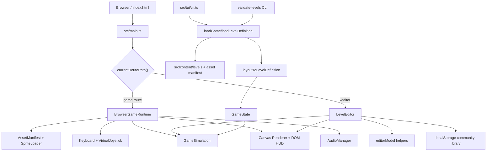
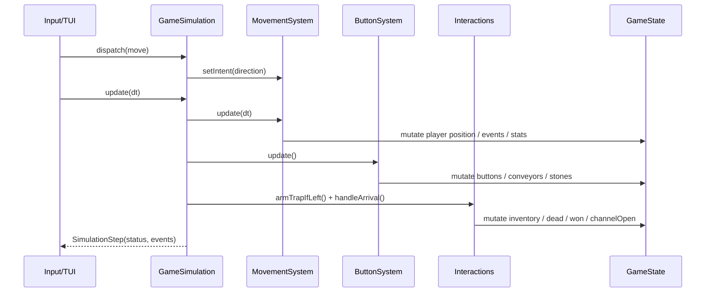
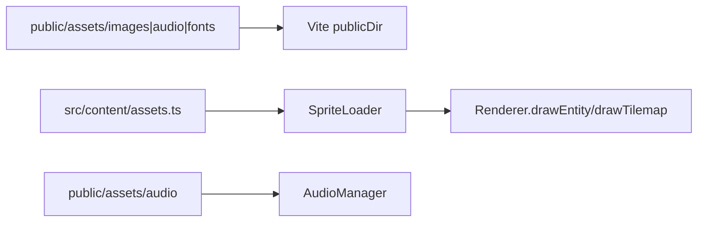

# Bobby Carrot 项目架构文档

本文档基于当前仓库代码梳理，用于说明 Bobby Carrot 的系统边界、模块职责、核心数据流和后续扩展入口。

## 1. 项目定位

Bobby Carrot 是一个纯 Vite + TypeScript 实现的网格解谜游戏。项目运行时不依赖 Construct runtime，而是把从 Construct 项目导出的布局、精灵和关卡规则转换为仓库内可维护的数据与状态机。

当前仓库包含四类能力：

- 浏览器游戏：`src/main.ts` 启动，`src/game/runtime.ts` 管理资源加载、输入、模拟器和 Canvas 渲染。
- 社区关卡编辑器：访问 `/editor` 时按需加载 `src/editor/app.ts`，支持本地编辑、导入导出、保存到 localStorage 和浏览器内 Playtest。
- 终端版本：`src/tui/cli.ts` 构建为 `dist-tui/cli.js`，通过同一套关卡数据和 `GameSimulation` 在终端渲染。
- 数据与校验工具：`scripts/export-game-data.mjs` 用于从源数据导出内容文件，`src/tools/validate-levels.ts` 用于批量校验内置关卡。

## 2. 技术栈与运行形态

| 维度 | 当前实现 |
| --- | --- |
| 语言 | TypeScript，ES Module |
| 构建工具 | Vite |
| Web 运行时 | 静态站点，Canvas 2D 渲染，DOM HUD/Overlay |
| TUI 运行时 | Node 20 目标，ANSI/emoji/ASCII 渲染 |
| 数据来源 | `src/content/levels/map*.ts` 与 `src/content/assets.ts` |
| 持久化 | 内置关卡随包发布；社区关卡保存在浏览器 localStorage |
| 部署 | GitHub Pages，`.github/workflows/static.yml` 在 `main` 分支构建并部署 `dist` |

项目没有后端服务、数据库、账号系统或网络 API。除静态资源加载外，核心游戏流程在客户端本地完成。

## 3. 顶层架构

架构核心是 `GameSimulation` 和 `GameState`。浏览器、编辑器 Playtest、TUI 和关卡校验都围绕同一套关卡定义与状态转换工作，差异主要体现在输入、渲染、音频和宿主环境。

## 4. 目录职责

| 路径 | 职责 |
| --- | --- |
| `src/main.ts` | Web 入口；根据路由选择游戏运行时或编辑器 |
| `src/game/` | 游戏领域核心、浏览器运行时、渲染、输入、资源、音频、关卡适配与校验 |
| `src/content/` | 内置关卡和资源 manifest；`index.ts` 提供动态关卡加载 |
| `src/content/levels/` | 30 个内置关卡，每关一个 `mapXX.ts` |
| `src/editor/` | 社区关卡编辑器 UI 和编辑模型 |
| `src/tui/` | 终端版入口和字符渲染 |
| `src/tools/` | Node 工具入口，目前是关卡校验 CLI |
| `scripts/` | 一次性/维护性数据导出脚本 |
| `public/assets/` | 图片、音频、字体等静态资源 |
| `dist/`、`dist-tui/`、`dist-tools/` | 构建产物 |

## 5. 核心数据模型

### 5.1 LevelDefinition

`src/game/levelDefinition.ts` 定义运行时关卡格式：

- `LevelDefinition`：关卡名称、像素尺寸、目标胡萝卜数量、tilemap 和实体列表。
- `LevelTilemapDefinition`：网格列数、行数、tile 大小、tile 数据和 tilemap 类型名。
- `LevelEntityDefinition`：实体 ID、语义类型、原始类型名、像素位置、网格位置、尺寸、实例变量和角度。

内置关卡最初保留接近 Construct 导出结构的 `Layout` 形态，运行时通过 `layoutToLevelDefinition()` 转换为统一关卡定义。

### 5.2 GameState

`src/game/types.ts` 定义 `GameState`，它是模拟器唯一的可变状态容器，包含：

- 当前地图名、tileSize、tilemap 数据。
- 所有实体和玩家实体引用。
- 胡萝卜与钥匙 inventory。
- 胜负状态、出口是否开启、最近踩过的机关 ID。
- 时间、步数和动画状态。
- 事件列表，用于驱动音效和调试反馈。

这种设计把规则更新集中在一个状态对象上，浏览器渲染器和 TUI 只读取状态，不各自实现游戏规则。

## 6. 浏览器游戏运行链路

浏览器游戏由 `BrowserGameRuntime` 统一协调：

1. `src/main.ts` 读取 `?map=` 和 `?community=` 查询参数。
2. `BrowserGameRuntime.start()` 加载资源 manifest，预加载图片，绑定键盘和虚拟摇杆。
3. 内置关卡走 `loadLevelDefinition(mapName)`；社区关卡走 `getCommunityLevel(id)`。
4. `validateLevelDefinition()` 在加载时给出关卡数据诊断。
5. `gameStateFromLevelDefinition()` 生成 `GameState`，再创建 `GameSimulation`。
6. `Renderer` 持有 Canvas、HUD 和成功浮层，每帧根据 `GameState` 重绘。
7. `requestAnimationFrame` tick 中处理输入、模拟器更新、事件音效和渲染。
8. 通关后 `advance` 进入下一关；社区关卡不自动进入内置关卡链路。

核心入口文件：

- `src/main.ts`
- `src/game/runtime.ts`
- `src/game/loader.ts`
- `src/game/levelAdapter.ts`
- `src/game/render.ts`
- `src/game/input.ts`
- `src/game/touchControls.ts`

## 7. 模拟器与规则分层

`src/game/simulation.ts` 是纯游戏规则入口。它不依赖 DOM、Canvas、音频或浏览器 API，只依赖 `GameState` 和 `GameAction`。

模拟器内部拆成三层：

| 模块 | 职责 |
| --- | --- |
| `movement.ts` | 单格移动、边界检查、碰撞、锁、方向石、传送带通行和传送带连续位移 |
| `buttons.ts` | 传送带按钮和石块按钮的状态切换，以及对应机关整体翻转/旋转 |
| `interactions.ts` | 到达格处理：收集胡萝卜/钥匙、开锁、陷阱、石块离开后旋转、出口与通关 |

单步更新流程：

目前移动是离散格子意图加像素插值：一次按键只消费一个方向意图，移动过程中按固定速度靠近目标格。该模式适合网格谜题，也让 TUI 可以用同一个模拟器按固定 tick 推进。

## 8. 内容与资源管线

内置内容分两类：

- 关卡布局：`src/content/levels/map1.ts` 到 `map30.ts`，由 `src/content/index.ts` 通过动态 import 加载。
- 资源 manifest：`src/content/assets.ts`，描述对象名、默认帧、动画帧、精灵图坐标和动画速度。

资源加载路径：

`scripts/export-game-data.mjs` 是维护脚本，用于把源 JSON 中的布局、实例变量、tilemap RLE 和动画帧导出为当前 TypeScript 内容文件。日常开发不依赖它运行，只有重新生成关卡/资源数据时才需要使用。

## 9. 编辑器架构

`/editor` 是按路由懒加载的本地编辑器，主要由两部分组成：

- `src/editor/app.ts`：编辑器 UI、事件绑定、Canvas 绘制、资源预览、导入导出、localStorage 库、Playtest overlay。
- `src/editor/editorModel.ts`：纯编辑模型助手，包括空白关卡、实体工具定义、tile palette、实体创建、移动、resize、解析社区关卡文件。

编辑器复用主游戏能力：

- 使用 `loadLevelDefinition()` 加载内置关卡作为参考。
- 使用 `validateLevelDefinition()` 实时诊断关卡结构。
- Playtest 时用 `gameStateFromLevelDefinition()`、`GameSimulation` 和 `Renderer` 在当前页内运行。
- 使用 `createCommunityLevel()`、`saveCommunityLevel()`、`listCommunityLevels()` 管理浏览器本地关卡库。

社区关卡数据结构由 `src/game/communityLevel.ts` 定义，当前 schemaVersion 为 `1`。所有社区关卡都保存在 localStorage key `bobby.communityLevels.v1` 下，不会同步到服务器。

## 10. TUI 架构

`src/tui/cli.ts` 提供终端版本：

- 通过 `loadGame(mapName)` 载入同一套 `GameState`。
- 使用 `GameSimulation` 执行移动、机关和通关规则。
- 使用 ANSI 清屏、备用屏幕、颜色、emoji 或 ASCII token 渲染视口。
- 支持 `--map` 指定关卡，`--ascii` 切换 ASCII 模式。

TUI 与浏览器版本共享核心规则，但不共享 Canvas、音频、触摸输入和浏览器资源加载逻辑。这是当前架构里比较清晰的端口/适配器边界。

## 11. 构建、校验与部署

| 命令 | 作用 |
| --- | --- |
| `npm run dev` | 启动 Vite 开发服务器，默认 `http://localhost:5173/` |
| `npm run build` | 构建浏览器静态站点到 `dist` |
| `npm run build:tui` | 构建终端 CLI 到 `dist-tui/cli.js` |
| `npm run build:tools` | 构建工具入口到 `dist-tools` |
| `npm run typecheck` | TypeScript 类型检查 |
| `npm run validate:levels` | 构建工具并校验所有内置关卡 |
| `npm run preview` | 本地预览 `dist` |

部署配置在 `.github/workflows/static.yml`。GitHub Actions 使用 Node 22、`npm ci`、`npm run typecheck` 和 `npm run build`，再把 `dist` 发布到 GitHub Pages。

Vite Web 构建使用根路径 `base: /`。GitHub Pages 发布时会把 `dist/index.html` 复制为 `dist/404.html` 和 `dist/editor/index.html`，用于静态托管下的前端路由兼容。

## 12. 关键架构决策

| 决策 | 现状与收益 | 代价/注意点 |
| --- | --- | --- |
| 纯客户端静态架构 | 部署简单，GitHub Pages 即可承载；离线规则逻辑易于复现 | 没有服务端能力，社区关卡只能本地存储或通过文件/PR 流转 |
| 规则核心集中在 `GameSimulation` | 浏览器、TUI、编辑器 Playtest 共享同一套规则，减少分叉 | `GameState` 是可变对象，新增规则时要注意状态字段语义和副作用顺序 |
| 关卡数据使用 TypeScript 模块 | 可被 Vite 静态分析和动态 import，类型引用方便 | 从源数据再生成时需要维护导出脚本一致性 |
| 渲染与规则分离 | Canvas/TUI/编辑器可以各自适配输出，不污染核心规则 | UI 层仍直接读取实体结构，实体字段变更会影响多个渲染端 |
| 编辑器本地化 | 不依赖账号和后台，便于社区低成本创作 | localStorage 容量和跨设备同步能力有限，导出文件仍是正式流转方式 |

## 13. 扩展建议

### 新增关卡

1. 新增 `src/content/levels/map31.ts`。
2. 更新 `src/content/index.ts` 的 `levelNames` 和 `levelLoaders`。
3. 更新 `src/game/config.ts` 的 `REQUIRED_CARROTS`。
4. 更新 `src/game/levelProgression.ts` 的 `LAST_LEVEL_NUMBER`。
5. 运行 `npm run typecheck` 和 `npm run validate:levels`。

如果关卡来自源 Construct 数据，优先通过 `scripts/export-game-data.mjs` 批量再生成，避免手工结构漂移。

### 新增实体/机关

1. 在 `src/game/types.ts` 扩展 `EntityKind`。
2. 在 `src/game/levelAdapter.ts` 更新 `kindMap` 或类型归类。
3. 在 `src/game/levelValidation.ts` 增加字段范围和结构校验。
4. 根据规则性质修改 `movement.ts`、`buttons.ts` 或 `interactions.ts`。
5. 在 `src/game/sprites.ts` 补充实体到动画帧的选择逻辑。
6. 在 `src/editor/editorModel.ts` 增加编辑器工具，并在 `src/editor/app.ts` 确认属性面板支持。
7. 在 `src/tui/cli.ts` 增加终端 token 和优先级。

### 引入服务端社区能力

当前最自然的演进路径是保留 `CommunityLevel` schema，把 localStorage 适配器替换/扩展为远程存储适配器。服务端需要优先补齐：

- 关卡上传、列表、下载和删除 API。
- schemaVersion 校验与迁移。
- 作者身份或投稿审核机制。
- 服务端关卡校验，复用或移植 `validateLevelDefinition()`。

## 14. 风险与待关注点

| 风险 | 影响 | 缓解方向 |
| --- | --- | --- |
| `GameState` 可变更新分散在多个模块 | 新机关可能引入顺序相关 bug | 对复杂机关补最小回归关卡或模拟器单元测试 |
| 内置关卡和资源 manifest 由脚本生成 | 手工修改与源数据可能不一致 | 明确源数据权威性，重新生成后运行校验 |
| 编辑器、浏览器和 TUI 都读取实体字段 | 字段重命名会有多端影响 | 新字段先通过类型和校验集中定义，再扩散到适配层 |
| localStorage 社区关卡无同步 | 用户换设备或清缓存会丢失本地库 | 强化导出文件流程，未来引入远程社区库 |
| Canvas 渲染无自动视觉回归 | UI/素材改动可能只在人工试玩中发现 | 对关键关卡和编辑器增加截图 smoke test |

## 15. 快速定位索引

- Web 入口：`src/main.ts`
- 浏览器运行时：`src/game/runtime.ts`
- 模拟器入口：`src/game/simulation.ts`
- 移动规则：`src/game/movement.ts`
- 到达格交互：`src/game/interactions.ts`
- 按钮系统：`src/game/buttons.ts`
- 关卡定义：`src/game/levelDefinition.ts`
- 关卡适配：`src/game/levelAdapter.ts`
- 关卡校验：`src/game/levelValidation.ts`
- Canvas 渲染：`src/game/render.ts`
- 精灵选择和绘制：`src/game/sprites.ts`
- 社区关卡存储：`src/game/communityLevel.ts`
- 编辑器：`src/editor/app.ts`
- 编辑器模型：`src/editor/editorModel.ts`
- TUI：`src/tui/cli.ts`
- 校验 CLI：`src/tools/validate-levels.ts`
- 内容导出脚本：`scripts/export-game-data.mjs`
